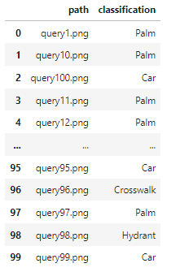
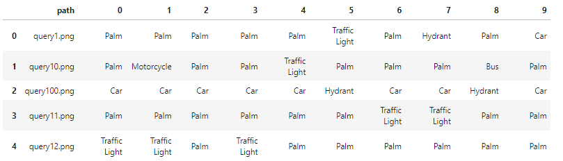
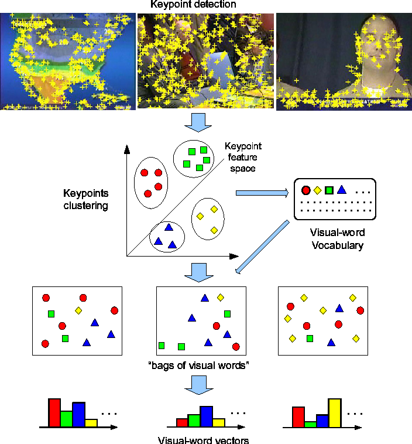

[Github](https://github.com/Pulyong/Early_Vision_Project/tree/main/Image_Classification)

**Summary**

- SIFT와 LBP를 이용한 Recaptcha Image Classification
- Bag of Visual Words 방법론을 이용하여 Classification을 진행
- 자세한 내용은 Github Readme 참고

**Role**

- 프로젝트를 혼자서 진행
- 방법론 탐색, 구현, 실험

**Result**

- SIFT, LBP를 이용한 Shape, Texture Feature에 대한 이해
- K-Means, KNN에 대한 이해
- Bag of Visual Words 방법론을 통한 Classification

**Period**

- 2023.06 ~ 2020.07